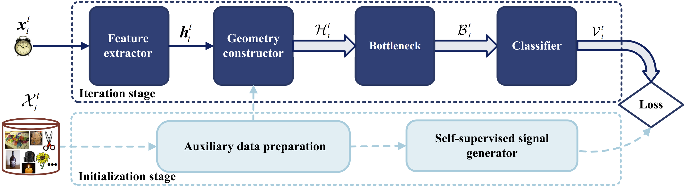

# Official implementation for [N2DCX]([[2107.12585\] Nearest Neighborhood-Based Deep Clustering for Source Data-absent Unsupervised Domain Adaptation (arxiv.org)](https://arxiv.org/abs/2107.12585))


Code (pytorch) for ['Nearest Neighborhood-Based Deep Clustering for Source Data-absent Unsupervised Domain Adaptation']([[2107.12585\] Nearest Neighborhood-Based Deep Clustering for Source Data-absent Unsupervised Domain Adaptation (arxiv.org)](https://arxiv.org/abs/2107.12585)) on Office-31, Office-Home, VisDA-C. This article is under review.

### Framework



### Datasets and Prerequisites

You need to download the [Office-31](https://drive.google.com/file/d/0B4IapRTv9pJ1WGZVd1VDMmhwdlE/view), [Office-Home](https://drive.google.com/file/d/0B81rNlvomiwed0V1YUxQdC1uOTg/view), [VisDA-C](https://github.com/VisionLearningGroup/taskcv-2017-public/tree/master/classification) dataset,  modify the path of images in each '.txt' under the folder './data/'.

The experiments are conducted on one GPU (NVIDIA RTX TITAN).

- python == 3.7.3
- pytorch ==1.6.0
- torchvision == 0.7.0


### Training and evaluation

1. First training model on the source data,  VisDA-C dataset is shown here.

> ```
> cd ./object
> ~/anaconda3/bin/python N2DC_source.py --trte val --output ckps2020r0/source/ --da uda --gpu_id 0 --dset VISDA-C --net resnet101 --lr 1e-3 --max_epoch 10 --s 0
> ```

2. Then adapting source model to target domain, with only the unlabeled target data.

> ```
> # train the target domain by N2DC
> ~/anaconda3/bin/python N2DC_target.py --cls_par 0.2 --da uda --dset VISDA-C --gpu_id 0 --s 0 --t 1 --output_src ckps2020r0/source/ --output ckps2020r0/target_n2dc/ --net resnet101 --lr 1e-3 --seed 2020
> 
> # train the target domain by N2DC-EX
> ~/anaconda3/bin/python N2DCEX_target.py --cls_par 0.2 --da uda --dset VISDA-C --gpu_id 0 --s 0 --t 1 --output_src ckps2020r0/source/ --output ckps2020r0/target_n2dcex/ --net resnet101 --lr 1e-3 --seed 2020
> ```

Please refer to **./object/run.sh** for all the settings for different methods and scenarios.

### Results


*The results of N2DCX is display under the folder './object/results/'.*

### Citation

If you find this code useful for your research, please cite our paper

> @article{tang2021n2dcx,
>   title={Nearest Neighborhood-Based Deep Clustering for Source Data-absent Unsupervised Domain Adaptation},
>   author={Song Tang, Yan Yang, Zhiyuan Ma, Norman Hendrich, Fanyu Zeng, Shuzhi Sam Ge, Changshui Zhang, Jianwei Zhang},
>   year={2021},
>   journal={arXiv:2107.12585},
>   url= {https://arxiv.org/abs/2107.12585}
> }

### Acknowledgement

 [DeepCluster(ECCV 2018)](https://github.com/facebookresearch/deepcluster)'s work.

 [SHOT (ICML 2020, also source-free)](https://github.com/tim-learn/SHOT)'s work.

### Contact

- tntechlab@hotmail.com


